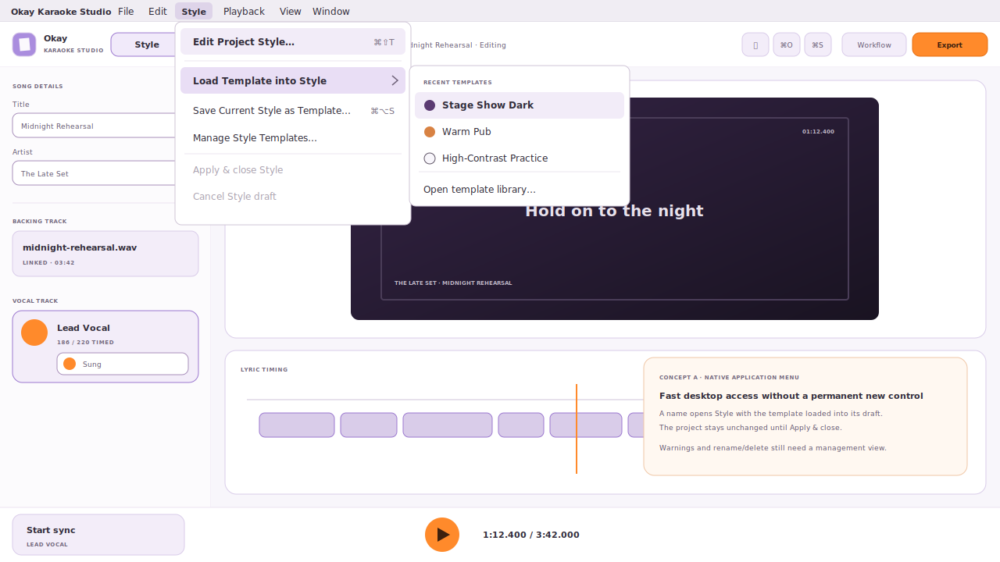
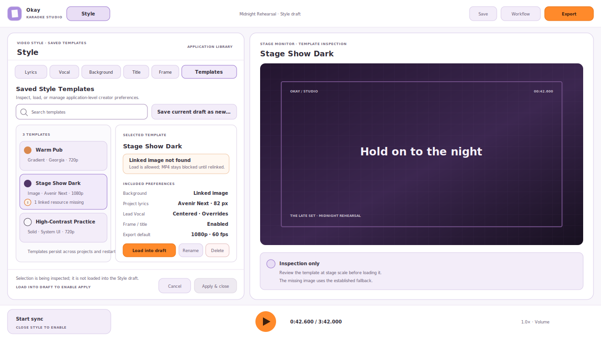
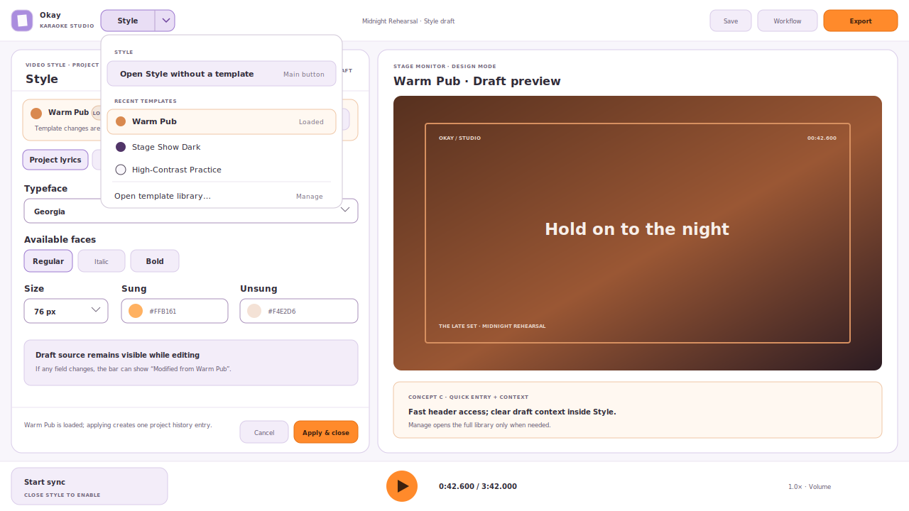

# Saved Style Templates — UI placement sketches

- **Status:** Concept B selected and implemented by
  [Issue #158](https://github.com/ok-sounds-good/ok-karaoke-studio/issues/158).
- **Canvas:** Each sketch uses the minimum supported 1280 × 720 window.
- **Existing contract:** [`VIDEO_STYLE_EDITOR_DESIGN.md`](./VIDEO_STYLE_EDITOR_DESIGN.md)
  remains authoritative until an accepted follow-up changes it.

## Shared interaction contract

All three concepts preserve the same behavior:

- Templates are application-level creator preferences, not project files.
- **Load into Style** replaces only fields owned by the template in the open
  Style draft. It does not immediately dirty the project or create history.
- **Apply & close** remains the single project mutation and creates at most one
  undoable history entry. **Cancel** discards the loaded template with the rest
  of the draft.
- Creating, renaming, or deleting a template changes the application template
  library without dirtying the open project.
- A template never replaces title, artist, audio, lyrics, section separators,
  timing, global offset, or vocal-track identity.
- Missing linked images and unavailable fonts remain selected and visible as
  warnings. Image failure blocks MP4 until relinked; font failure uses the same
  named deterministic Preview/MP4 fallback.
- Destructive deletion needs confirmation. Menus, tabs, lists, dialogs, and
  warnings need complete keyboard and screen-reader behavior.

## Concept A — native application menu

Add a top-level **Style** menu beside File/Edit/Playback. It provides the normal
**Edit Project Style…** entry, a recent-template submenu, and commands to save
or manage templates.

Selecting a template opens the existing same-window Style editor with that
template loaded into its draft. The native menu is therefore an entry point,
not an immediate Apply command.

**Strengths**

- Familiar desktop location and efficient keyboard access.
- Keeps the main application header unchanged.
- Recent templates are available without first opening Style.

**Risks**

- Native menus are less visually discoverable and differ across macOS and
  Windows.
- Template warnings and detailed management do not fit naturally in a menu.
- A menu-only design could make users believe selecting a template immediately
  changes the project.

## Concept B — Templates destination inside Style

**Selected direction.**

Add **Templates** as a sixth destination in the existing Style editor. The
destination owns a searchable list, selected-template summary, missing-resource
warnings, and create/rename/delete/load actions. Live Preview stays beside it.

**Strengths**

- Best context: users can inspect a template and its Preview before loading it.
- The draft/Apply model is visually explicit.
- Warnings, empty states, and management operations have enough room.

**Risks**

- Six destinations make the compact Style navigation denser at 1280 × 720.
- Users must open Style before they can reach any template operation.
- A whole destination may feel heavy for users who mostly reuse one or two
  templates.

## Concept C — hybrid header launcher and contextual Style bar

Turn the current header **Style** action into a split action. Its main region
opens Style normally; the disclosure region opens recent templates and library
commands. Once Style is open, a compact contextual bar identifies the loaded
template, whether the draft has diverged, and provides **Save draft as new…** or
**Manage…**.

The full library opens in the Style workspace when needed; frequent loading does
not require visiting it first.

**Strengths**

- Combines quick reuse with clear in-context draft status.
- Keeps detailed management out of the always-visible header.
- Works consistently inside the app on macOS and Windows; a native Style menu
  can later mirror the same commands as a secondary route.

**Risks**

- A split button is slightly more complex than the current single Style action.
- The distinction between opening Style and loading a recent template must be
  unmistakable to keyboard, pointer, and assistive-technology users.
- The contextual bar consumes some vertical space in the compact editor.

## Comparison

| Question                          | A: native menu           | B: Style destination      | C: hybrid                 |
| --------------------------------- | ------------------------ | ------------------------- | ------------------------- |
| Fast repeat use                   | Strong                   | Weak                      | Strong                    |
| Template inspection before load   | Weak                     | Strong                    | Strong when library opens |
| Cross-platform visual consistency | Weak                     | Strong                    | Strong                    |
| 1280 × 720 pressure               | None in app              | Higher navigation density | Small contextual bar      |
| Missing-resource explanation      | Requires another surface | Best                      | Best in library           |
| Relationship to Apply & close     | Indirect                 | Clearest                  | Clear after entry         |

## Design questions for acceptance

1. Should templates be visible before Style opens, or only inside Style?
2. Is a native **Style** application menu useful as the primary route, a
   secondary keyboard route, or unnecessary?
3. Should the in-Style library be a sixth destination, or a temporary library
   view reached from a compact contextual bar?
4. Should the quick launcher show recent templates, pinned templates, or no
   individual names?
5. Is inline rename/delete acceptable, or should management use a selected-row
   detail area with an explicit delete confirmation?

Concept B is the accepted placement. Concepts A and C remain comparison
artifacts rather than implementation scope.
